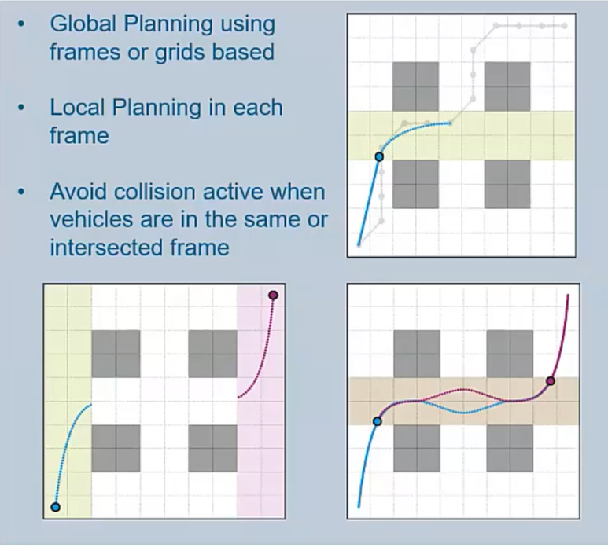
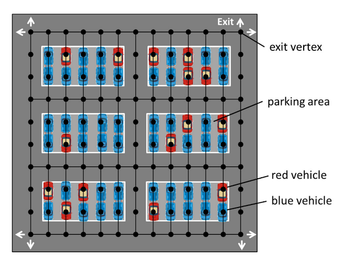
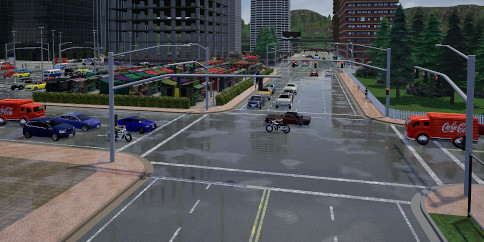

# Autonomous Parking for Self-Driving Cars

The [source code](https://github.com/randoruf/ece4095-parking-system-demo) 

## Acknowledgement

Thanks for Akansel Cosgun providing this interesting idea!

In fact, I only have done the first part of the project.... 

## Future Work 

- (2021 June 1st)  I only completed the first two tasks in my Final Year Project. There are a lot of things that can be done in the future. The development plan will be listed below. I will promise I will do them for the rest of my life....... [Jiaoyang Li](https://jiaoyangli.me/research/) 's research gave me a lot of inspirations. 
- (2021 June 2nd)  I found Toyota and Siemens had already studied the automated valet parking. 
  - (2020) Here is the Webinar of [Siemens automated valet parking](https://www.plm.automation.siemens.com/global/en/webinar/autonomous-valet-parking/70539) (they use very simple grid map to avoid conflicts between cars, I think that make senses, although I solved the same problem by thinking motion planning, simple grid is called path planning instead of motion planning). **Because the car is very big...... using a simple grid map is enough....** 
  - 
  - Then Jiaoyang Li's **Multi-Agent Path Plannin**g paper can help....  [Research - Jiaoyang Li](https://jiaoyangli.me/research/)
  - (2019) Here is the paper from Toyota Lab [Multi-Agent Path Finding with Priority for Cooperative Automated Valet Parking](https://ieeexplore.ieee.org/document/8917112) 
  - 
  - My simulation envrionment is too complicated..... In fact, the car is big, so the multi-agent path planning is enough. The obstcale avoidance can be done locally..... 

**Objective**: This project aims to develop algorithms for 

​	1) Planning: a path planner for parking autonomous vehicles, 

​	2) Perception: detecting empty parking spaces and vehicles using cameras installed in the parking lot

​	3) Integration: demonstrating the integrated system.

**Details**: This project will be developed and tested fully in simulation. 

- [ ] For the first part of the project (planning), we will use 2D simulation and investigate well-known motion planning algorithms such as A*, RRT and PRM. 
  - [x] parking spaces assignment algorithms (static scenarios) 
  - [x] single-agent motion planning under kinematic constraints (Reed Shepp Curve and RRT\*) with simple replanning to avoid obstacles. 
  - [ ] parking spaces assignment algorithms (dynamic scenarios, some parking spaces are occupied, and vehicle can go in and out)
  - [ ] sensitivity analysis on the orietntation term for weight Euclidean distance (grid search), will the $w_0$ change the conclusions or simulation results. What is the best value for the orientation term. 
  - [ ] Adding more heursitcs function to parking space assignment algorithms (moving obstacle density, how far to the moving obstacles, and whether its right and left side parking spaces are occupied). 
  - [ ] multi-agent motion planning (PRM, safety interval A*.... )

- [ ] For the second part (perception), we will use off-the-shelf object detection algorithms (i.e. YOLO) to detect vehicles and parking spaces in camera images. 
  - [ ] YOLO detecting parking spaces 
  - [ ] YOLO detecting vehicles 
  - [ ] Localization for vehicles 
  - [ ] LiDAR sensor fusion (can we use Camera to create occupancy grid map or not?)
- [ ] For the third part, we will investigate the influence of vehicles and pedestrians. 
  - [ ] the model to predicte the moving of vehicles (simple particle filter is enough, as the car is non-holonomic, easy to predict)
  - [ ] the model to predict human movement (require some researches on pedestrian model)
  - [ ] decision making using Markov model or probability distribution
- [ ] What if the human driver will not follow the reference path given by the parking lot? 
- [ ] Before using CARLA to simulate, you need path tracking algorithms and controller (pure pursuit path tracking, PID and MPC). 

- [ ] (Optional) For the fourth part (integration), we will use a 3D simulator such as CARLA to demonstrate the parking behavior, using the planner and the vision system.
  - [ ] CARLA simulation is just for demonstration, it is optinal because *motion planning will be in 2D* (otherwises, the problem will be extremely hard to solve). 
  - [ ]   
  - [ ] Unity ML-agents is also enough... 
  - [ ]  

**Prerequisites**: 

​	Competency in C++, Python or MATLAB.

