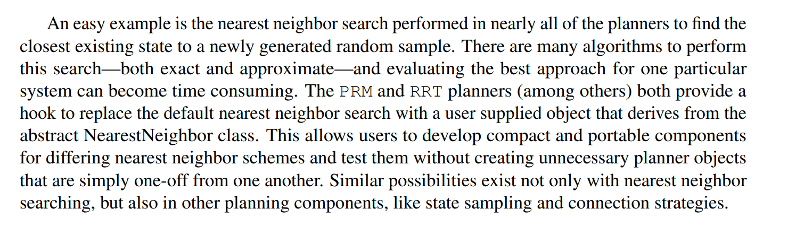
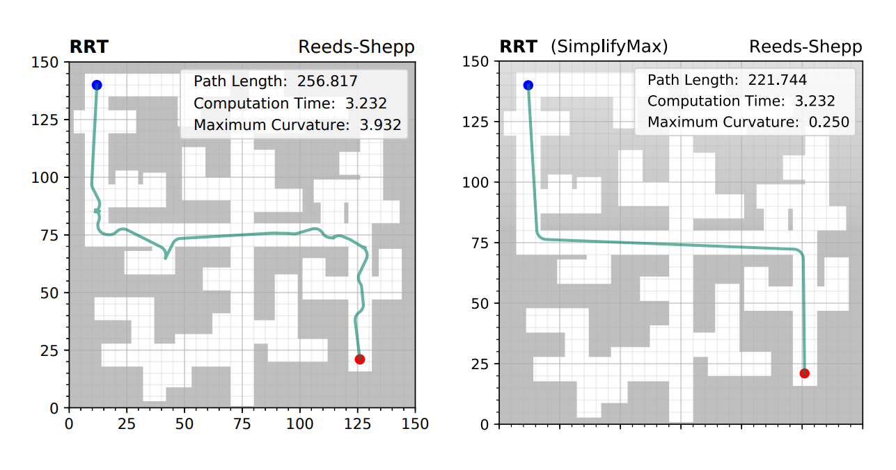
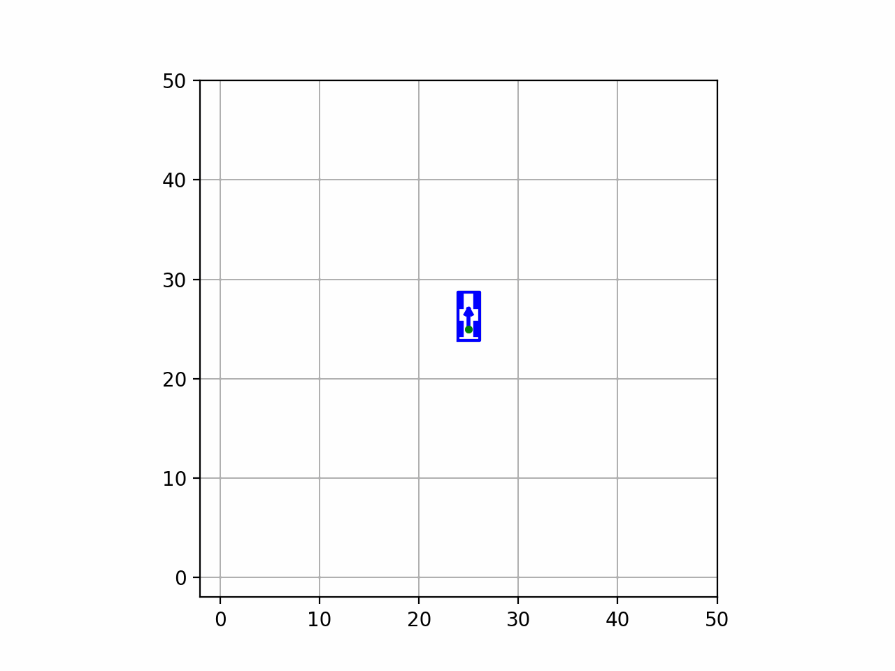
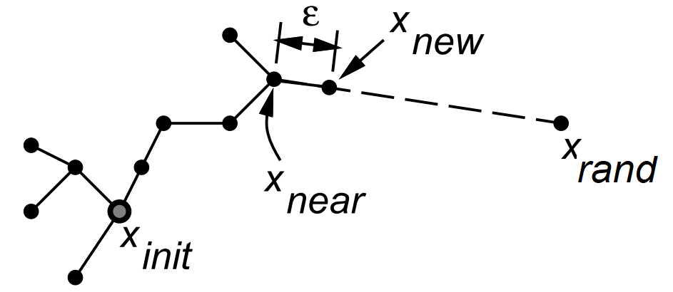
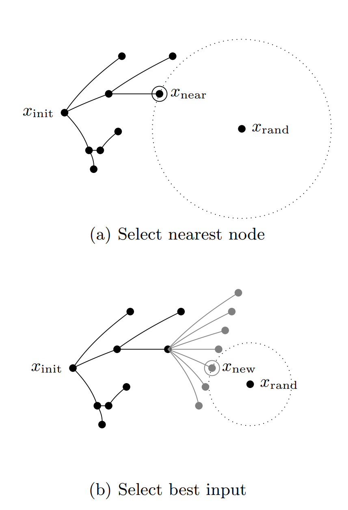
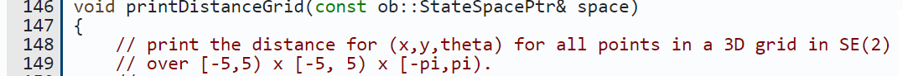
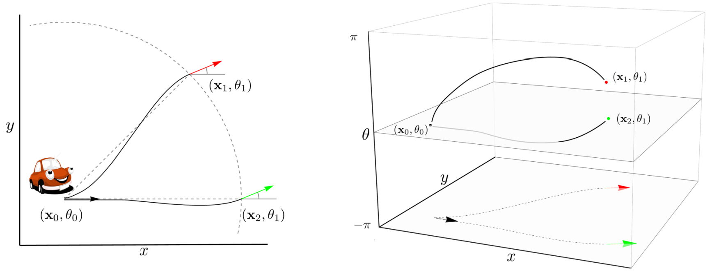
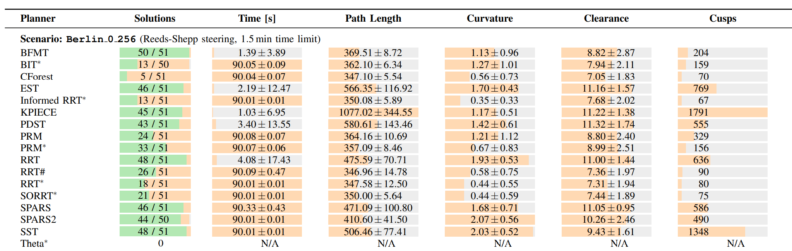
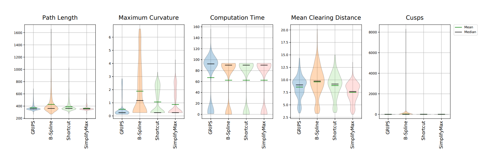

<!-- _class: cover-->

# Full Details.....(Don't use this)

**Presenter**: Haohua Li 
**Supervisor**: Akansel Cosgun

 

*May 2021*

---
# Table of Content 

---
# Problem Overview

Show the shortcoming of "simple replanning". 
- each agent is indepedent 
- each agent replans in 10Hz
- they would not coordinate with each other but follow simple traffic rules 
  - (philosophy lunch table)
- show the movie here ... 

---
# Project Aim
A centralized system 
- Look for empty parking spaces
- Assign goals to entered cars
- Provide a reference path to cars

--- 
# Optimal Planning 

<https://answers.ros.org/question/369268/which-planner-to-use-for-a-mobile-robot-trailer-system/>

Option A: The sbpl cart planner relies on a set of pre-defined **motion primitives** to incrementally construct and search a **lattice graph** (**Lattice** and **Hybrid A\***).

Option B: Use a near-optimal sampling-based planning algorithm from OMPL's suite of control-based planners. I recommend the **SST algorithm**.

Option C: Use an asymptotically optimal planner from OMPL's suite of geometric planners. I recommend **RRT\***. In order to use this, you'll need to define an inverse kinematic function that can **connect any two states by a kinematically feasible path**.

Among these options, I recommend Option A. Lattice planning is not too difficult to implement and generally gives good results in practice.

---
# Planner Primitives 

The OMPL primer says there is a hook to neighbour, sampling, connection...

---
# Post-Smoothing Methods 

https://ompl.kavrakilab.org/classompl_1_1geometric_1_1PathSimplifier.html

---
<!-- footer: LaValle, S. M. (1998). Rapidly-exploring random trees: A new tool for path planning.
 -->

# Rapidly-exploring Random Tree (RRT)

  

 - random sampling $\bold{x_{rand}}$
 - find the nearest neighbour $\bold{x_{near}}$
 - steer from $\bold{x_{near}}$ to $\bold{x_{rand}}$ 
   - such that $\bold{x_{new}}$ is closer to $\bold{x_{near}}$ 
 - set $\bold{x_{near}}$ as the parent of $\bold{x_{new}}$

---
<!-- footer: LaValle, S. M. (2006). Planning algorithms. Cambridge university press. -->
# Simple Kinematic Car Model 

The differential constraint, given the linear velocity $v$ and steering angle $\phi$

$$
\dot{x} = v \cos(\theta) \\
\dot{y} = v \sin(\theta)  \\ 
\dot{\theta} =  \frac{v \tan(\phi)}{L} \\
$$

where $\phi<|\phi_{max}|$ and $\theta\in[-\pi, \pi)$.

The state $\bold{x} = [x, y, \theta]$
The control  $\bold{u} = [v, \phi]$ and $v$ is constant. 

---
<!-- footer: Kunz, T., & Stilman, M. (2015). Kinodynamic RRTs with fixed time step and best-input extension are not probabilistically complete 
--> 

# Kinodynamic RRT 
Sampling in both state and control spaces. 
- random sampling $\bold{x_{rand}}$
 - find the nearest neighbour $\bold{x_{near}}$
 - steer from $\bold{x_{near}}$ to $\bold{x_{rand}}$
   - choose a time interval $\Delta t_{new}$ 
   - choose a control input $\bold{u_{new}}$
   - forward integrate by Euler method such that $\bold{x_{new}}$ is closer to $\bold{x_{rand}}$
 - set $\bold{x_{near}}$ as the parent of $\bold{x_{new}}$
 - record $\bold{u_{new}}$, $\Delta t_{new}$ with the edge

---
<!-- footer: Bekkers, E. J., Duits, R., Mashtakov, A., & Sanguinetti, G. R. (2015). A PDE approach to data-driven sub-Riemannian geodesics in SE (2). SIAM Journal on Imaging Sciences, 8(4), 2740-2770.
--> 

# SE(2) Special Euclidean Group

<!-- <https://ompl.kavrakilab.org/GeometricCarPlanning_8cpp_source.html>

<http://www.frontendvision.net/2018/wp-content/uploads/2018/12/Bekkers-SubRiemannianGeometry.pdf>

-->

 

---
<!-- footer: LaValle, S. M., & Kuffner Jr, J. J. (2001). Randomized kinodynamic planning. The international journal of robotics research, 20(5), 378-400.
--> 

# Kinodynamic RRT

### How to choose  $\Delta t_{new}$ and $\bold{u_{new}}$  ? 
-  a random variable-length $\Delta t_{new}$
-  a random control input $\bold{u}$

### Distance metric in $SE(2)$ 
$$
\sqrt{(x_1-x_2)^2 + (y_1-y_2)^2 + w_0(\theta_1-\theta_2)^2}
$$
where $w \in [0, 1)$  is the weight of rotation. 

But $w_0$ is hard to tune (grid search?).  

---
<!-- footer: ? -->

# Steer Function 
http://www.spencer.eu/papers/palmieriICAPS14.pdf

https://github.com/palmieri/posq

---
# Sampling Strategies 

If close to the goal, 

---
<!-- footer: ? --> 

# Methodloggy

## Basic Method 1 : Real-time Replaning 
- replan in 10 Hz

## Basic Method 2 : Prioritized Planing 

---
<!-- footer: ? --> 
# Basic Method 1 : Real-time Replanning 

## Goal Assignment Strategies
- Random 
- Euclidean Distance 

## Real-time Replanning
- 

---
<!-- footer: ? --> 
# Basic Method 2 : Prioritized Planning

## Goal (planning order) Assignment Strategies
- Random 
- Euclidean Distance 
- Anytime Optimization + Largest Neighbourhood Search [4]
  - Random Neighbour 
  - Collision-based ?

## RRT in State-Time Space 
- how to add time paramter to the node ?
- weighted distance again???

---

# Experiment Results (example 1)
https://arxiv.org/abs/2003.03543

You can include the "success rate, average time, " 

---
# Experiment Results (example 2)

---

# Reference 

[4] Jiaoyang Li, Zhe Chen, Yi Zheng, Shao-Hung Chen, Daniel Harabor, Peter J. Stuckey, Hang Ma, & Sven Koenig (2021). Scalable Rail Planning and Replanning: Winning the 2020 Flatland Challenge. In Proceedings of the 31th International Conference on Automated Planning and Scheduling (ICAPS).