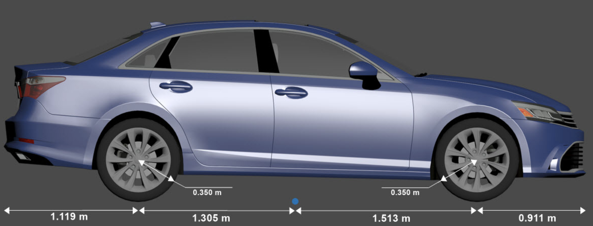
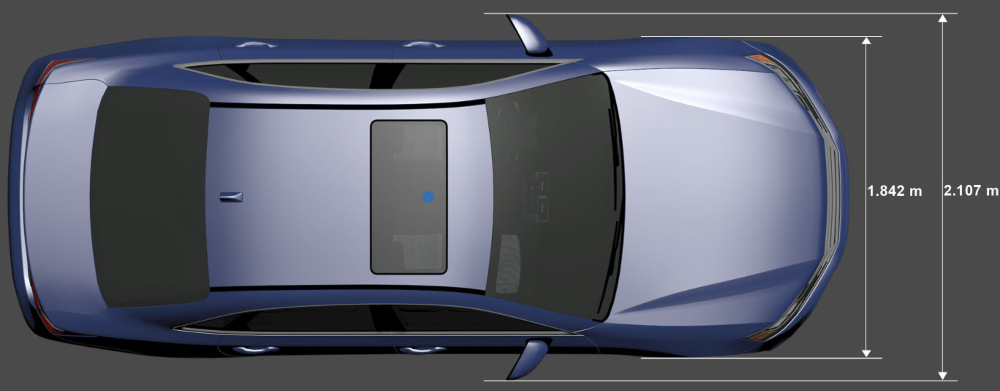
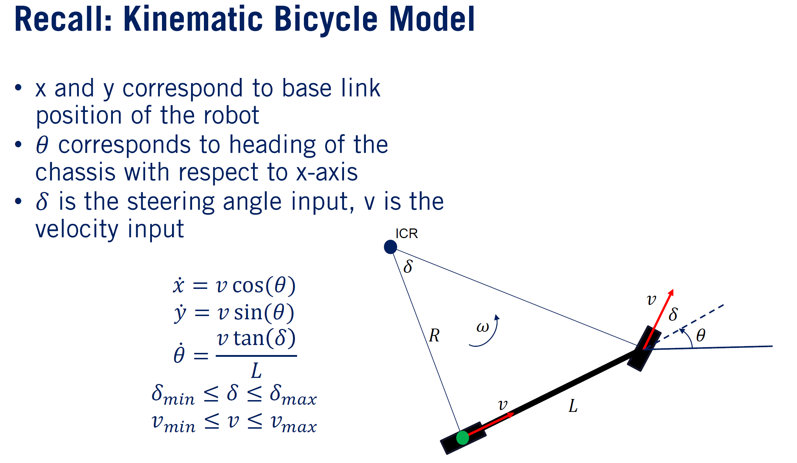
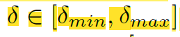
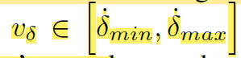
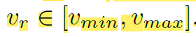

# Vehicle Model

### Vehicle Dimension 

https://au.mathworks.com/help/driving/ref/sedan.html

```
self.width = 2.20        			# [m] width of vehicle
self.length = 4.82					# [m] length of vehicle 

self.rf_distance = 3.80    			# [m] distance from rear axle to front end of vehicle
self.rb_length = 1.12    			# [m] distance from rear axle to back end of vehicle
self.rear_front_axle_distance = 2.8     # [m] distance from rear axle to front axle
```






---

### Kinematic Bicycle Model 

- [Lesson 1: Trajectory Propagation - Module 6: Reactive Planning in Static Environments | Coursera](https://www.coursera.org/lecture/motion-planning-self-driving-cars/lesson-1-trajectory-propagation-5hguf)
- [RRT Page: Photo and Animation Gallery (lavalle.pl)](http://lavalle.pl/rrt/gallery_carsmooth.html)
- [ompl/demos/RigidBodyPlanningWithIntegrationAndControls.cpp Source File (kavrakilab.org)](https://ompl.kavrakilab.org/RigidBodyPlanningWithIntegrationAndControls_8cpp_source.html)




- Note that we have a maximum **steering angle** and maximum **steering rate**. 


1. The mechanical limit on the steering angle 
2. The limit on the steering rate 
3. The limit on the car speed 

Note that the ***control inputs*** now are $$v_{\delta}$$ and $$v_{r}$$ .

